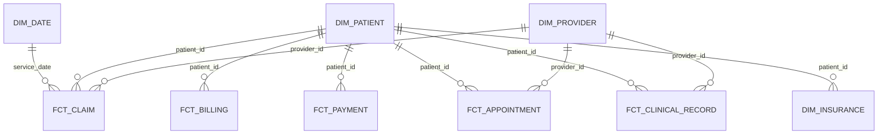

# Dimensional Data Model

## Slowly changing dimensions
- Patient: Type 2 for address/city/postcode/patient type
- Insurance: Type 2 for payer/policy/status/effective dates
- Doctor assignment: Type 2 for patient-provider assignment history

## Fact grains
- Claim = one financial/administrative claim
- Billing = one billing transaction
- Payment = one payment transaction
- Appointment = one scheduled appointment
- Clinical record = one clinical event/record
